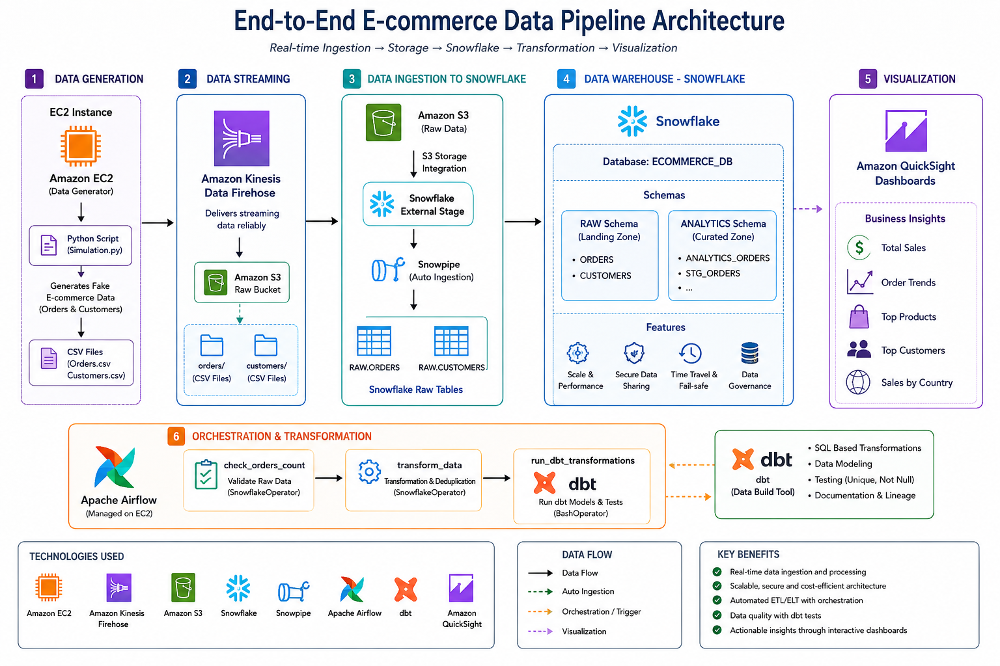

# Ecommerce Data Pipeline using Snowflake & Managed Airflow on AWS

## 📌 Project Overview

This project demonstrates a complete **End-to-End Modern Data Engineering Pipeline** for an ecommerce platform using **AWS**, **Snowflake**, **Apache Airflow**, and **dbt**.

The pipeline generates fake ecommerce transactions in real-time, streams them through AWS services, stores them in Snowflake, performs automated transformations and deduplication, and finally visualizes business insights using Amazon QuickSight.

The architecture follows a modern cloud-native data engineering workflow:

**EC2 → Kinesis Firehose → Amazon S3 → Snowpipe → Snowflake → Airflow → dbt → QuickSight**

---

# 📂 Complete Project File Structure

```text
Real-Time-Ecommerce-Data-Pipeline-on-Aws-using-Snowflake-Airflow-dbt/
│
├── documentation/
│   └── Ecommerce_Data_Pipeline_Implementation_Guide.pdf
│ 
├── architecture-diagram/
│   └── Architecture.png
│
├── configs/
│   ├── agent.json
│   ├── trust-relationship.json
│   └── airflow-snowflake-connection-details.md
│
├── scripts/
│   ├── simulation.py
│   └── requirements.txt
│
├── sql/
│   ├── snowflake-storage-integration.sql
│   ├── snowflake-stage-and-tables.sql
│   ├── snowpipe-setup.sql
│   ├── analytics-orders-table.sql
│   ├── manual-transformation.sql
│   ├── duplicate-check.sql
│   ├── snowflake-integration-of-dbt.sql
│   └── quicksight-queries.sql
│
├── airflow/
│   ├── snowflake_automation_v1.py
│   ├── snowflake_automation_v2.py
│   ├── snowflake_automation_dbt.py
│   ├── airflow-setup-commands.md
│   ├── airflow-transformation-commands.md
│   └── airflow-dbt-automation-commands.md
│
├── dbt/
│   ├── sources.yml
│   ├── schema.yml
│   ├── stg_orders.sql
│   ├── dbt_project.yml
│   └── profiles.yml
│
├── setup-guides/
│   ├── ec2-kinesis-s3-setup.md
│   ├── logs-and-verification.md
│   ├── snowflake-setup-guide.md
│   └── quicksight-setup-guide.md
│
└── README.md
```

---

# 🚀 Tech Stack

## Cloud & Infrastructure

* Amazon EC2
* Amazon S3
* Amazon Kinesis Data Firehose
* IAM Roles & Policies
* Amazon QuickSight

## Data Warehouse

* Snowflake
* Snowpipe
* External Stages
* Storage Integrations

## Orchestration & Transformation

* Apache Airflow
* dbt (Data Build Tool)

## Programming

* Python
* SQL

---

# 📊 Architecture



# 🔥 Key Features

* Real-time ecommerce data simulation
* Streaming ingestion pipeline using Kinesis Firehose
* Automated loading into Snowflake using Snowpipe
* Data orchestration with Apache Airflow
* Deduplication and transformation logic
* dbt-based analytics engineering workflow
* Automated data quality testing
* Interactive dashboards in Amazon QuickSight
* Fully scalable cloud-native architecture

---

# 📂 Project Workflow

## Phase 1 — Data Ingestion

### Components

* EC2 Instance
* Kinesis Firehose
* Amazon S3

### Process

1. Python script generates fake ecommerce orders and customer data.
2. Kinesis Agent monitors CSV files.
3. Firehose streams data into S3 Raw Buckets.
4. Data lands in:

   * `orders/`
   * `customers/`

---

## Phase 2 — Snowflake Integration

### Components

* Snowflake Storage Integration
* External Stage
* Snowpipe

### Process

1. Snowflake connects with S3 using IAM Role.
2. External Stage reads S3 files.
3. Snowpipe automatically ingests new files.
4. Raw data loads into:

   * `RAW.ORDERS`
   * `RAW.CUSTOMERS`

---

## Phase 3 — Airflow Orchestration

### Components

* Apache Airflow
* SnowflakeOperator
* BashOperator

### Process

Airflow automates:

* Data validation
* Transformation queries
* dbt execution
* Scheduled workflows

### DAG Workflow

```text
check_orders_count
        ↓
transform_data
        ↓
run_dbt_transformations
```

---

## Phase 4 — Data Transformation

### Goals

* Remove duplicate records
* Clean raw data
* Build analytics-ready tables

### Technologies

* Snowflake SQL
* dbt Models
* Airflow DAGs

### Output Tables

* `ANALYTICS_ORDERS`
* `STG_ORDERS`

---

## Phase 5 — Data Visualization

### Tool

Amazon QuickSight

### Dashboard Metrics

* Total Sales
* Order Trends
* Product Distribution
* Top Customers
* Revenue Insights

---

# 🛠️ Folder Structure

```text
project/
│
├── dags/
│   └── snowflake_automation.py
│
├── dbt/
│   ├── models/
│   │   ├── stg_orders.sql
│   │   ├── schema.yml
│   │   └── sources.yml
│
├── scripts/
│   └── simulation.py
│
├── screenshots/
│
└── README.md
```

---

# ⚙️ Setup Instructions

## 1️⃣ AWS Infrastructure

* Create IAM Roles
* Create S3 Buckets
* Configure Kinesis Firehose
* Launch EC2 Instance

## 2️⃣ Data Simulation

Install dependencies:

```bash
pip install Faker
```

Run generator script:

```bash
python3 simulation.py
```

---

## 3️⃣ Snowflake Setup

### Create Storage Integration

```sql
CREATE STORAGE INTEGRATION s3_integration
TYPE = EXTERNAL_STAGE
STORAGE_PROVIDER = S3;
```

### Create External Stage

```sql
CREATE STAGE my_s3_stage;
```

### Create Snowpipe

```sql
CREATE PIPE orders_pipe;
```

---

## 4️⃣ Airflow Setup

Install Airflow:

```bash
pip install apache-airflow
```

Run services:

```bash
airflow scheduler
airflow webserver
```

---

## 5️⃣ dbt Setup

Install dbt:

```bash
pip install dbt-snowflake
```

Initialize project:

```bash
dbt init ecommerce_dbt
```

Run transformations:

```bash
dbt run
```

Run tests:

```bash
dbt test
```

---

# ✅ Data Quality Checks

dbt tests ensure:

* No NULL Order IDs
* Unique Order IDs
* Duplicate removal
* Clean analytics tables

Example test:

```yaml
tests:
  - unique
  - not_null
```

---

# 📈 Sample Business Insights

The pipeline can generate insights such as:

* Hourly sales trends
* Most purchased products
* Customer purchase behavior
* Revenue analysis
* Country-wise sales distribution

---

# 🔄 Automation Flow

```text
EC2 Script
   ↓
Kinesis Firehose
   ↓
Amazon S3
   ↓
Snowpipe
   ↓
Snowflake RAW Tables
   ↓
Airflow DAG
   ↓
dbt Models & Tests
   ↓
Analytics Tables
   ↓
QuickSight Dashboard
```

---

# 💡 Learning Outcomes

This project demonstrates practical implementation of:

* Real-time Data Engineering
* Cloud Data Pipelines
* ETL/ELT Architecture
* Workflow Orchestration
* Analytics Engineering
* Data Warehousing
* Data Quality Testing
* Business Intelligence

---

# 📌 Future Improvements

* Add Kafka Streaming
* CI/CD Integration
* Terraform Infrastructure Automation
* Kubernetes Deployment
* Role-based Security
* Monitoring & Alerting
* Incremental dbt Models
* Real Production APIs

---

# 👨‍💻 Author

**Areesha Hashmi**
BS Chemistry Graduate | Aspiring Data Engineer & Cloud Analytics Enthusiast

---

# ⭐ Conclusion

This project represents a complete modern data engineering ecosystem built on AWS and Snowflake. It combines streaming ingestion, cloud storage, orchestration, transformation, analytics engineering, and visualization into one scalable pipeline.

The architecture follows industry-standard practices and provides hands-on experience with real-world Data Engineering workflows.
